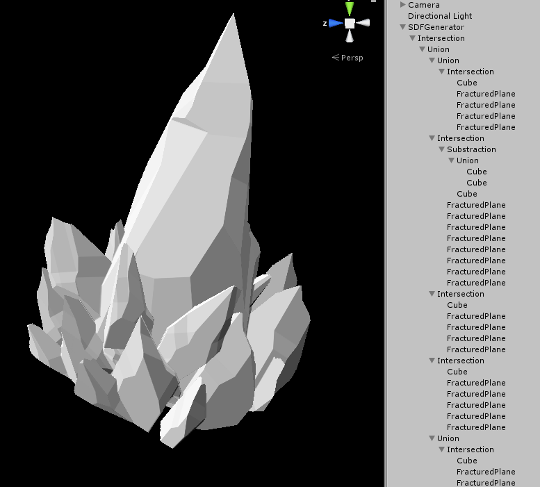

# sdf-gen-unity
A signed distance function generator running inside Unity. An example result raymarched scene can be found [here](https://www.shadertoy.com/view/XtSfDD)

It lets the user make and combine distance functions to make interesting scenes, inside an intuitive editor such as Unity. It tries to optimize the code for specific known cases (for example, it tries to prevent using matrices when dealing with planes), but it is far from complete.

As an example, it converts the following scene:



Into the following code:


```
float sdf_generated(vec3 p)
{
	vec3 wsPos = vec3(.0,.0,.0);
	float stack[12];
	vec3 pStack[12];
	pStack[0] = p;
	pStack[0] = (pStack[0] * vec3(1.0,.98,1.0)) - vec3(.0,.0,.0);
	pStack[1] = pStack[0];
	pStack[2] = (mat4(.999, .0, .055, .0, .0, 1.0, .0, .0, -.055, .0, .999, .0, -1.509, .14, .498, 1.0) * vec4(pStack[1], 1.0)).xyz;
	pStack[2].xz = pModPolar(pStack[2].xz , 8.0);
	pStack[3] = (mat4(.795, .934, 2.28, .0, -.491, 1.642, -1.25, .0, -1.401, -.045, 1.732, .0, -.397, -.911, -7.876, 1.0) * vec4(pStack[2], 1.0)).xyz;
	wsPos = (mat4(.5, .0, .0, .0, .0, .137, -.104, .0, .0, .029, .489, .0, -.8, -.064, .867, 1.0) * vec4(pStack[3], 1.0)).xyz;
	stack[3] = fBox(wsPos);
	wsPos = (mat4(1.128, .386, .417, .0, -.926, .053, 1.543, .0, 1.235, -.313, .775, .0, -.769, -1.532, -2.843, 1.0) * vec4(pStack[3], 1.0)).xyz;
	stack[3] = max(stack[3],wsPos.y + saturate(wsPos.x * .5) * .1 + saturate(wsPos.z + .5) * .1);
	wsPos = (mat4(-1.008, .237, -1.253, .0, -1.259, .149, 1.228, .0, 1.027, .415, .275, .0, 4.273, -.714, -.96, 1.0) * vec4(pStack[3], 1.0)).xyz;
	stack[3] = max(stack[3],wsPos.y + saturate(wsPos.x * .5) * .1 + saturate(wsPos.z + .5) * .1);
	wsPos = (mat4(-1.633, -.219, .498, .0, .244, .173, 1.651, .0, -.964, .415, -.425, .0, 3.007, -.072, -3.193, 1.0) * vec4(pStack[3], 1.0)).xyz;
	stack[3] = max(stack[3],wsPos.y + saturate(wsPos.x * .5) * .1 + saturate(wsPos.z + .5) * .1);
	wsPos = (mat4(-.526, -.46, -.495, .0, -1.791, .161, -.242, .0, .411, .112, -1.689, .0, 5.514, .189, 1.112, 1.0) * vec4(pStack[3], 1.0)).xyz;
	stack[3] = max(stack[3],wsPos.y + saturate(wsPos.x * .5) * .1 + saturate(wsPos.z + .5) * .1);
	stack[2] = stack[3];
	stack[1] = stack[2];
	pStack[4] = (mat4(.788, .097, .425, .0, -.135, .792, .022, .0, -.418, -.073, .795, .0, 1.929, -6.665, -.972, 1.0) * vec4(pStack[1], 1.0)).xyz;
	pStack[5] = pStack[4];
	pStack[6] = pStack[5];
	wsPos = (mat4(.203, .084, .048, .0, -.057, .293, -.032, .0, -.028, .013, .407, .0, -.895, .281, 1.418, 1.0) * vec4(pStack[6], 1.0)).xyz;
	stack[6] = fBox(wsPos);
	wsPos = (mat4(.149, .025, -.291, .0, .07, .222, .18, .0, .135, -.143, .228, .0, -.128, .448, .615, 1.0) * vec4(pStack[6], 1.0)).xyz;
	stack[6] = min( stack[6],fBox(wsPos));
	stack[5] = stack[6];
	wsPos = (mat4(.163, -.007, .238, .0, -.015, .102, .035, .0, -.23, -.012, .166, .0, -.815, .176, -.268, 1.0) * vec4(pStack[5], 1.0)).xyz;
	stack[5] = max(-stack[5],fBox(wsPos));
	stack[4] = stack[5];
	wsPos = (mat4(1.68, -.01, .848, .0, -.871, .133, 1.509, .0, -.276, -.482, .4, .0, -5.624, -1.2, .976, 1.0) * vec4(pStack[4], 1.0)).xyz;
	stack[4] = max(stack[4],wsPos.y + saturate(wsPos.x * .5) * .1 + saturate(wsPos.z + .5) * .1);
	wsPos = (mat4(-1.288, -.085, -1.277, .0, -1.377, .184, 1.044, .0, .314, .457, -.658, .0, 2.367, .783, 2.615, 1.0) * vec4(pStack[4], 1.0)).xyz;
	stack[4] = max(stack[4],wsPos.y + saturate(wsPos.x * .5) * .1 + saturate(wsPos.z + .5) * .1);
	wsPos = (mat4(-.526, -.46, -.495, .0, -1.791, .161, -.242, .0, .411, .112, -1.689, .0, 1.346, .968, -.74, 1.0) * vec4(pStack[4], 1.0)).xyz;
	stack[4] = max(stack[4],wsPos.y + saturate(wsPos.x * .5) * .1 + saturate(wsPos.z + .5) * .1);
	wsPos = (mat4(.649, .468, -.157, .0, -1.578, .171, .798, .0, .862, -.04, 1.579, .0, .804, -1.56, 3.123, 1.0) * vec4(pStack[4], 1.0)).xyz;
	stack[4] = max(stack[4],wsPos.y + saturate(wsPos.x * .5) * .1 + saturate(wsPos.z + .5) * .1);
	wsPos = (mat4(-.446, -.32, 1.219, .0, -1.751, .078, -.321, .0, .016, -.369, -1.124, .0, -1.128, -.361, -6.142, 1.0) * vec4(pStack[4], 1.0)).xyz;
	stack[4] = max(stack[4],wsPos.y + saturate(wsPos.x * .5) * .1 + saturate(wsPos.z + .5) * .1);
	wsPos = (mat4(1.533, .154, .696, .0, -.87, .377, .718, .0, -.329, -.281, 1.342, .0, -4.104, -1.442, -.118, 1.0) * vec4(pStack[4], 1.0)).xyz;
	stack[4] = max(stack[4],wsPos.y + saturate(wsPos.x * .5) * .1 + saturate(wsPos.z + .5) * .1);
	wsPos = (mat4(1.853, -.102, -.211, .0, .221, -.014, 1.757, .0, -.392, -.489, -.008, .0, -1.772, -1.406, 6.376, 1.0) * vec4(pStack[4], 1.0)).xyz;
	stack[4] = max(stack[4],wsPos.y + saturate(wsPos.x * .5) * .1 + saturate(wsPos.z + .5) * .1);
	wsPos = (mat4(-.556, -.453, -.525, .0, -.17, -.141, 1.687, .0, -1.815, .152, .003, .0, -1.992, -.067, 6.05, 1.0) * vec4(pStack[4], 1.0)).xyz;
	stack[4] = max(stack[4],wsPos.y + saturate(wsPos.x * .5) * .1 + saturate(wsPos.z + .5) * .1);
	stack[1] = min( stack[1],stack[4]);
	pStack[7] = (mat4(-.943, -.128, .043, .0, -.107, 1.049, .137, .0, -.059, .146, -.94, .0, 1.858, .33, -1.42, 1.0) * vec4(pStack[1], 1.0)).xyz;
	pStack[7].xz = pModPolar(pStack[7].xz , 10.0);
	wsPos = (mat4(.7, .065, .111, .0, -.117, .263, -.261, .0, -.161, .092, .671, .0, -1.761, -.553, -.067, 1.0) * vec4(pStack[7], 1.0)).xyz;
	stack[7] = fBox(wsPos);
	wsPos = (mat4(1.676, .466, 1.232, .0, -1.862, .058, 1.912, .0, 1.213, -.556, 1.231, .0, -3.822, -1.844, -6.583, 1.0) * vec4(pStack[7], 1.0)).xyz;
	stack[7] = max(stack[7],wsPos.y + saturate(wsPos.x * .5) * .1 + saturate(wsPos.z + .5) * .1);
	wsPos = (mat4(-1.467, .491, -1.337, .0, -1.788, .06, 1.971, .0, 1.549, .534, 1.009, .0, 6.023, -1.973, -.383, 1.0) * vec4(pStack[7], 1.0)).xyz;
	stack[7] = max(stack[7],wsPos.y + saturate(wsPos.x * .5) * .1 + saturate(wsPos.z + .5) * .1);
	wsPos = (mat4(-2.494, -.141, 1.034, .0, .951, .2, 2.324, .0, -.79, .686, -.467, .0, 6.624, -.322, -6.471, 1.0) * vec4(pStack[7], 1.0)).xyz;
	stack[7] = max(stack[7],wsPos.y + saturate(wsPos.x * .5) * .1 + saturate(wsPos.z + .5) * .1);
	wsPos = (mat4(-1.116, -.568, -1.242, .0, -2.513, .31, .163, .0, .432, .334, -2.263, .0, 7.905, .708, 4.921, 1.0) * vec4(pStack[7], 1.0)).xyz;
	stack[7] = max(stack[7],wsPos.y + saturate(wsPos.x * .5) * .1 + saturate(wsPos.z + .5) * .1);
	stack[1] = min( stack[1],stack[7]);
	pStack[8] = (mat4(-.025, -.278, 1.937, .0, -.454, 1.573, .319, .0, -1.912, -.37, -.101, .0, .038, -4.893, -1.369, 1.0) * vec4(pStack[1], 1.0)).xyz;
	pStack[8].xz = pModPolar(pStack[8].xz , 5.0);
	wsPos = (mat4(.326, .111, .293, .0, -.106, .197, -.236, .0, -.365, .042, .33, .0, -1.141, -.145, -1.004, 1.0) * vec4(pStack[8], 1.0)).xyz;
	stack[8] = fBox(wsPos);
	wsPos = (mat4(1.01, .023, 1.506, .0, -1.623, .004, .939, .0, .032, -.499, .078, .0, -4.952, -.781, -2.879, 1.0) * vec4(pStack[8], 1.0)).xyz;
	stack[8] = max(stack[8],wsPos.y + saturate(wsPos.x * .5) * .1 + saturate(wsPos.z + .5) * .1);
	wsPos = (mat4(-1.354, .304, -.64, .0, -.774, .034, 1.62, .0, 1.106, .396, .35, .0, 2.953, -1.14, 2.649, 1.0) * vec4(pStack[8], 1.0)).xyz;
	stack[8] = max(stack[8],wsPos.y + saturate(wsPos.x * .5) * .1 + saturate(wsPos.z + .5) * .1);
	wsPos = (mat4(-1.462, -.104, 1.084, .0, .892, .238, 1.325, .0, -.851, .427, -.474, .0, 6.541, .212, -.951, 1.0) * vec4(pStack[8], 1.0)).xyz;
	stack[8] = max(stack[8],wsPos.y + saturate(wsPos.x * .5) * .1 + saturate(wsPos.z + .5) * .1);
	wsPos = (mat4(-1.166, -.349, -.663, .0, -1.442, .328, .007, .0, .463, .142, -1.648, .0, 3.098, 1.04, 2.74, 1.0) * vec4(pStack[8], 1.0)).xyz;
	stack[8] = max(stack[8],wsPos.y + saturate(wsPos.x * .5) * .1 + saturate(wsPos.z + .5) * .1);
	wsPos = (mat4(.024, .494, .28, .0, -1.723, -.028, .764, .0, .829, -.074, 1.579, .0, .498, -2.115, -.172, 1.0) * vec4(pStack[8], 1.0)).xyz;
	stack[8] = max(stack[8],wsPos.y + saturate(wsPos.x * .5) * .1 + saturate(wsPos.z + .5) * .1);
	stack[1] = min( stack[1],stack[8]);
	pStack[9] = (mat4(.795, .0, -.714, .0, .302, 3.241, .336, .0, .647, -1.512, .721, .0, -.378, -3.143, .939, 1.0) * vec4(pStack[1], 1.0)).xyz;
	pStack[9].xz = pModPolar(pStack[9].xz , 6.0);
	pStack[10] = (mat4(.28, .504, 2.966, .0, -.047, 1.821, -.83, .0, -1.66, .033, .523, .0, 1.505, 4.294, -7.819, 1.0) * vec4(pStack[9], 1.0)).xyz;
	wsPos = (mat4(.5, .0, .0, .0, .0, .137, -.104, .0, .0, .029, .489, .0, -.805, -.247, .582, 1.0) * vec4(pStack[10], 1.0)).xyz;
	stack[10] = fBox(wsPos);
	wsPos = (mat4(1.128, .386, .417, .0, -.926, .053, 1.543, .0, 1.235, -.313, .775, .0, -.769, -1.532, -2.843, 1.0) * vec4(pStack[10], 1.0)).xyz;
	stack[10] = max(stack[10],wsPos.y + saturate(wsPos.x * .5) * .1 + saturate(wsPos.z + .5) * .1);
	wsPos = (mat4(-1.008, .237, -1.253, .0, -1.259, .149, 1.228, .0, 1.027, .415, .275, .0, 4.273, -.714, -.96, 1.0) * vec4(pStack[10], 1.0)).xyz;
	stack[10] = max(stack[10],wsPos.y + saturate(wsPos.x * .5) * .1 + saturate(wsPos.z + .5) * .1);
	wsPos = (mat4(-1.633, -.219, .498, .0, .244, .173, 1.651, .0, -.964, .415, -.425, .0, 3.007, -.072, -3.193, 1.0) * vec4(pStack[10], 1.0)).xyz;
	stack[10] = max(stack[10],wsPos.y + saturate(wsPos.x * .5) * .1 + saturate(wsPos.z + .5) * .1);
	wsPos = (mat4(-.526, -.46, -.495, .0, -1.791, .161, -.242, .0, .411, .112, -1.689, .0, 5.514, .189, 1.112, 1.0) * vec4(pStack[10], 1.0)).xyz;
	stack[10] = max(stack[10],wsPos.y + saturate(wsPos.x * .5) * .1 + saturate(wsPos.z + .5) * .1);
	stack[9] = stack[10];
	stack[1] = min( stack[1],stack[9]);
	pStack[11] = (mat4(1.43, -.088, -1.481, .0, -.092, 1.769, -.567, .0, .828, .35, 2.494, .0, -1.382, -4.146, -2.058, 1.0) * vec4(pStack[1], 1.0)).xyz;
	wsPos = (mat4(.461, .046, -.065, .0, -.193, .102, -.182, .0, -.02, .084, .259, .0, -.378, -.212, .663, 1.0) * vec4(pStack[11], 1.0)).xyz;
	stack[11] = fBox(wsPos);
	wsPos = (mat4(1.128, .386, .417, .0, -.926, .053, 1.543, .0, 1.235, -.313, .775, .0, -.769, -1.532, -2.843, 1.0) * vec4(pStack[11], 1.0)).xyz;
	stack[11] = max(stack[11],wsPos.y + saturate(wsPos.x * .5) * .1 + saturate(wsPos.z + .5) * .1);
	wsPos = (mat4(-1.008, .237, -1.253, .0, -1.259, .149, 1.228, .0, 1.027, .415, .275, .0, 4.057, -.994, -1.057, 1.0) * vec4(pStack[11], 1.0)).xyz;
	stack[11] = max(stack[11],wsPos.y + saturate(wsPos.x * .5) * .1 + saturate(wsPos.z + .5) * .1);
	wsPos = (mat4(-1.633, -.219, .498, .0, .244, .173, 1.651, .0, -.964, .415, -.425, .0, 3.007, -.072, -3.193, 1.0) * vec4(pStack[11], 1.0)).xyz;
	stack[11] = max(stack[11],wsPos.y + saturate(wsPos.x * .5) * .1 + saturate(wsPos.z + .5) * .1);
	wsPos = (mat4(-.526, -.46, -.495, .0, -1.791, .161, -.242, .0, .411, .112, -1.689, .0, 5.374, .102, 1.328, 1.0) * vec4(pStack[11], 1.0)).xyz;
	stack[11] = max(stack[11],wsPos.y + saturate(wsPos.x * .5) * .1 + saturate(wsPos.z + .5) * .1);
	stack[1] = min( stack[1],stack[11]);
	stack[0] = stack[1];
	stack[0] = max(stack[0],dot(pStack[0] - vec3(1.24,.07,2.43), vec3(-.129,-.864,.486)));
	stack[0] = max(stack[0],dot(pStack[0] - vec3(-.2,-1.41,1.48), vec3(.107,-.943,-.314)));
	return stack[0];
}

```
